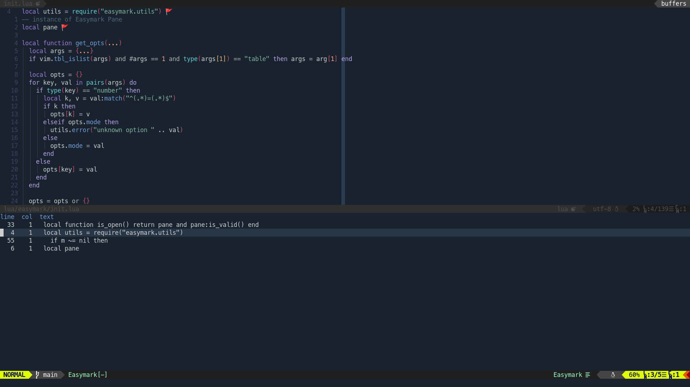

# 𝑒𝒶𝓈𝓎𝓂𝒶𝓇𝓀.𝓃𝓋𝒾𝓂
A Neovim plugin allows toggling marks per line. A quickfix window shows all marks for manage.

All marks work for current buffer.




## Features

- Toggle marks per  line 🚩
- Navigate all marks with quickfix window
- Fully customizable (keymaps, action keys, mark opts)
- Works with `Neovim extmarks`


## Requirements

- Neovim >= 0.6


## Installation

### [packer](https://github.com/wbthomason/packer.nvim)

```lua
-- Lua
use {
  "0x00-ketsu/easymark.nvim",
  config = function()
    require("easymark").setup {
      -- your configuration comes here
      -- or leave it empty to use the default settings
      -- refer to the configuration section below
    }
  end
}
```


## Configuration

### Setup

Easymark default parameter items:

```lua
{
  position = "bottom", -- position choices: bottom|top|left|right
  height = 20,
  width = 30,
  pane_action_keys = {
    close = "q", -- close mark window
    cancel = "<esc>", -- close the preview and get back to your last position
    refresh = "r", -- manually refresh
    jump = {"<cr>", "<tab>"}, -- jump to the mark
    jump_close = {"o"}, -- jump to the mark and close mark window
    toggle_mode = "t", -- toggle mark between "marked" and "unmacked" mode
    next = "j", -- next item
    previous = "k" -- preview item
  },
  mark_opts = {
    virt_text = "🚩",
    virt_text_pos = 'eol', -- 'eol' | 'overlay' | 'right_align'
  },
  auto_preview = true,
}
```


## Usage

Example Keybindings:

```lua
-- lua
vim.api.nvim_set_keymap('n', 'mt', '<cmd>lua require"easymark".toggle_pane()<CR>', {silent = true, noremap = true})
vim.api.nvim_set_keymap('n', 'mm', '<cmd>lua require"easymark".toggle_mark()<CR>', {silent = true, noremap = true})
vim.api.nvim_set_keymap('n', 'mc', '<cmd>lua require"easymark".clear_mark()<CR>', {silent = true, noremap = true})
vim.api.nvim_set_keymap('n', 'mn', '<cmd>lua require"easymark".next_mark()<CR>', {silent = true, noremap = true})
vim.api.nvim_set_keymap('n', 'mp', '<cmd>lua require"easymark".prev_mark()<CR>', {silent = true, noremap = true})
```


## Todo list

- [ ] Close `Easymark` Pane return to source parent window

- [ ] Disable `Easymark` keymaps if filetype is `nerdtree` or `tagbar` ...

  


## Inspiration by

- [vim-bookmarks](https://github.com/MattesGroeger/vim-bookmarks) by Mattes Groeger
- [trouble.nvim](https://github.com/folke/trouble.nvim) by Folke Lemaitre


## License

MIT
